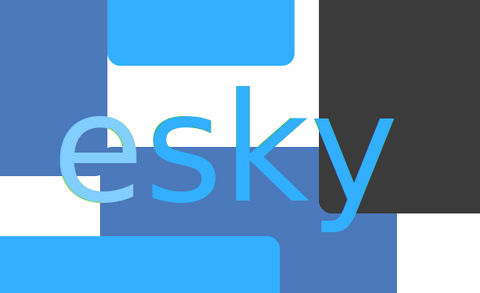

  </img>
  <h2>Simple library for making compilers supporting a big amount of platforms.</h2>

Esky - is a library for making compilers, that support big amount of platforms, bigger then [`LLVM`](https://llvm.org/) does. I am planning to make this project part of [`Hike`](https://github.com/hikelang/hike) programming language distribution. I hope this project will grow up into something amazing 😀!

## Supported platforms:
- [ ] C++
- [ ] Python
- [ ] Typescript
- [ ] Go
- [ ] Rust
- [ ] x86
- [ ] x64
- [ ] ARM

## License:

The project is currently under the Apache 2.0 license.

<pre>
Copyright 2022 Salimgereyev Adi

Licensed under the Apache License, Version 2.0 (the "License");
you may not use this file except in compliance with the License.
You may obtain a copy of the License at

    http://www.apache.org/licenses/LICENSE-2.0

Unless required by applicable law or agreed to in writing, software
distributed under the License is distributed on an "AS IS" BASIS,
WITHOUT WARRANTIES OR CONDITIONS OF ANY KIND, either express or implied.
See the License for the specific language governing permissions and
limitations under the License.
</pre>

## Code of conduct
You check it [here](https://github.com/hikelang/esky/blob/master/CODE_OF_CONDUCT.md).